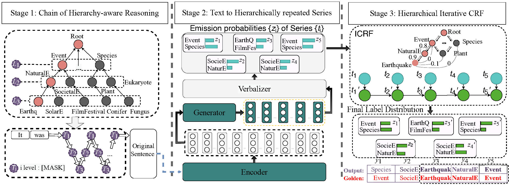

# Domain-Hierarchy Adaptation via Chain of Iterative Reasoning for Few-shot Hierarchical Text Classification

This is the official repository for the paper
[Domain-Hierarchy Adaptation via Chain of Iterative Reasoning for Few-shot Hierarchical Text Classification] [IJCAI 2024]

## Requirements

* Python == 3.8
* torch == 1.10.1
* openprompt == 0.1.2
* transformers == 4.28.0
* datasets == 2.4.0

## Train

```
usage: train.py [--lr LR] [--dataset DATA] [--batch_size BATCH] [--device DEVICE] [--shot SHOT]
                [--seed SEED].....

optional arguments:
  --lr                      LR, learning rate for language model.                   
  --dataset                 {wos,dbp} Dataset.
  --batch BATCH             Batch size
  --shot SHOT               fewshot seeting
  --device DEVICE           cuda id or cpu. Default: 0 stands for cuda:0
  --seed SEED               Random seed.
  --template_id             which template of chain of hierarchy-aware reasoning to use
```

- Results are in `./result/HierICRF.txt`.
- Checkpoints are in `./ckpts/`. Two checkpoints are kept based on macro-F1 and micro-F1 respectively.

## Run the scripts
```shell
## Train and test on WOS dataset
python train_model.py --lr 5e-5 --device=0 --batch_size=8 --dataset=wos --shot=4 --seed=550 --iter_num=5 --template_id=6
```

## Reproducibility

We experiment on one Tesla V100-SXM2-32GB with CUDA version $10.2$. We use a batch size of $8$ to fully tap one GPU.

## Citation
If you found this repository is helpful, please cite our paper:
```
@inproceedings{ijcai2024p698,
  title     = {Domain-Hierarchy Adaptation via Chain of Iterative Reasoning for Few-shot Hierarchical Text Classification},
  author    = {Ji, Ke and Wang, Peng and Ke, Wenjun and Li, Guozheng and Liu, Jiajun and Gao, Jingsheng and Shang, Ziyu},
  booktitle = {Proceedings of the Thirty-Third International Joint Conference on
               Artificial Intelligence, {IJCAI-24}},
  publisher = {International Joint Conferences on Artificial Intelligence Organization},
  editor    = {Kate Larson},
  pages     = {6315--6323},
  year      = {2024},
  month     = {8},
  note      = {Main Track},
  doi       = {10.24963/ijcai.2024/698},
  url       = {https://doi.org/10.24963/ijcai.2024/698},
}

```
